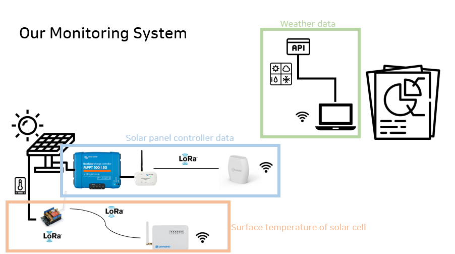
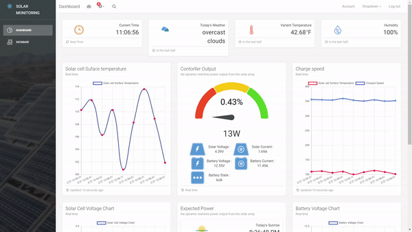
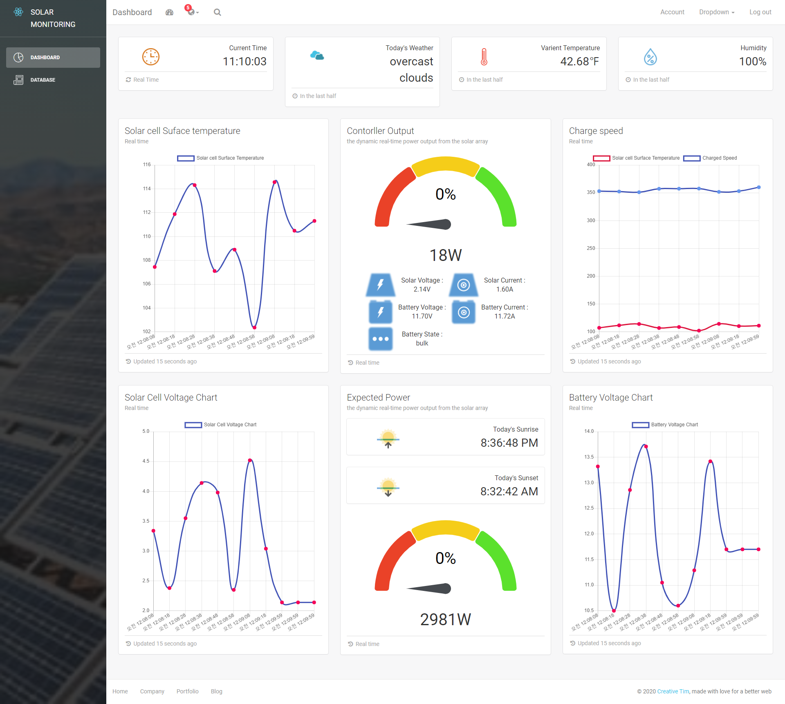
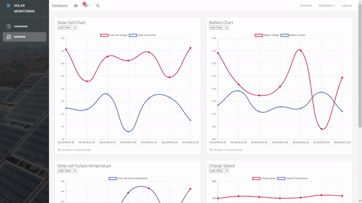
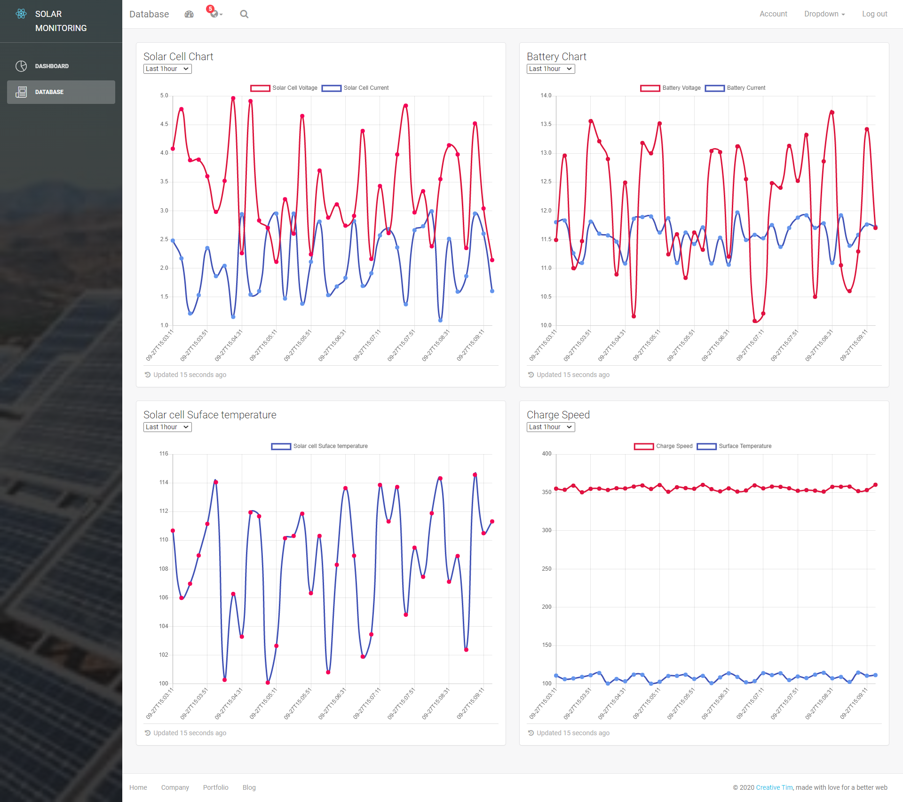

<h1 align="center">
    Design of Solar Panels Efficiency Monitoring System
</h1>

<p align="center">
  <strong>ⓒ Team I-GO-AT</strong><br>
  2019-2020 Purdue winter program<br>
  Sehyeong Lee(CNU)<br>Soomin Lee(CNU)<br>Laith  Ellis(Purdue Univ)
</p>

<p align="center">
    
</p>


## :clipboard: Introduce

#### **System architecture for continuous monitoring of solar panels efficiency**

The system collects various data, including the surface temperature of the solar panels, degree of power charge, weather information, and other technical data. The different components that carry out this data collection include a Wireless Sensor Network (WSN), OpenWeatherMap Application Programming Interface (API), and the equipment of Victron Energy and Dragino.

Our web-based GUI displays all of the data collected, which can be easily presented to farmers allowing them to monitor solar energy efficiency in real-time.

## :book: Architecture
<p align="center">
    
</p>

#### Solar Panel Controller Data ####
Solar charge Controller -> LoRaWAN Module -> LoRaWAN GateWay -> TTN -> MySQL(Our Server) -> GUI
#### Surface Temperature Of Solar Cell ####
Sensor -> LoRaGateWay -> Router -> ThingSpeak -> MySQL(Our Server) -> GUI
#### Weather Data ####
OpenWeatherMap API(https://openweathermap.org) -> GUI

## :camera: WEB - GUI

- Main monitoring (Dashboard)
<p align="center">
    
</p>
<p align="center">
    
</p>

- history monitoring (Database)
<p align="center">
    
</p>
<p align="center">
    
</p>

## :heavy_check_mark: Development Environment

```
##### Front #####

React
Bootstrap
Chart.js
Material-ui

##### Backend #####

Node.js
Express
MySQL

```